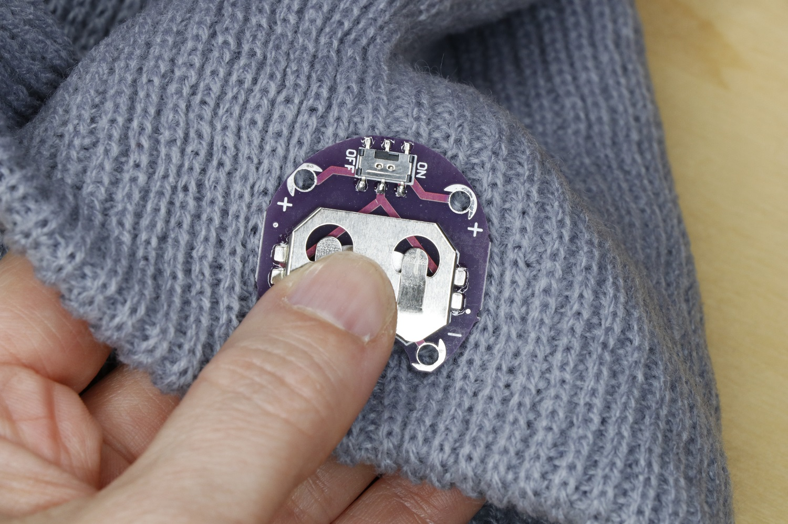

## Prepare the hat

The LEDs will be attached to the outside of the hat, and the battery holder will be hidden inside the hat’s folded cuff. You’ll either need to use a hat with a cuff or fold back the edge of a longer hat. If your cuff doesn’t want to stay folded, tack it up at the sides with a few stitches of regular sewing thread. The cuff should be at least 4cm wide to accommodate the battery holder.

