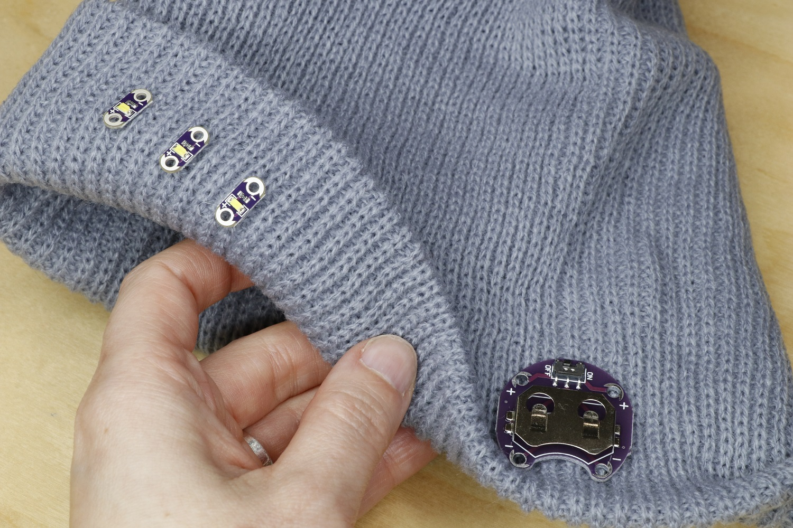

## Add the components

If your sewable LEDs came in a strip, gently snap them apart with small pliers. Find the front of the hat. Place the three LEDs on the front of the hat fold with the negative (-) side up and the positive (+) side down. Space them about 1.5cm apart. Tack each LED in place with a small amount of hot glue.

Since the battery holder is a rigid, flat piece, we’ll place it on the side of the hat so it will be against the flat part of your head. Fold the edge down at one side of your hat. Place the battery holder so that its opening points toward the edge of the hat and the negative sew tab is on top. Use a dab of hot glue to tack it in place for now.

