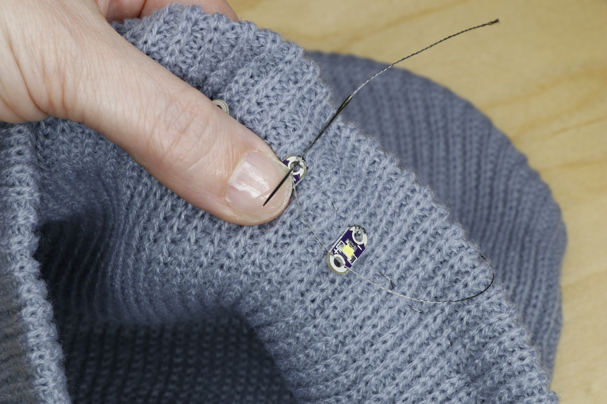

## Sew the circuit
Now that we have our components tacked in place, we can sew the circuit to connect them. Thread your needle with about 50cm of conductive thread and tie a knot at the end. This may feel like a long piece of thread, but we want to sew each leg of the circuit in one continuous run.

Start at the battery holder: begin your run by stitching four or five times around the positive sew tab of the battery holder. Pull the thread snug against the sew tab for a good connection.

Use a simple running stitch to sew to the positive sew tab of the first LED. Loop around the positive sew tab four or five times, pulling snug each time. Continue sewing this leg of your circuit, and connect to the positive sew tabs of the other two LEDs in the same manner.

When you’ve connected the last positive sew tab, tie off your thread with a tight knot. Trim the thread close to the knot to prevent short circuits.

Rethread your needle with another 50cm length of conductive thread. Go back to the battery holder and repeat this process to sew the negative leg of your circuit. Keep this second thread run at least 1 cm away from the first.

